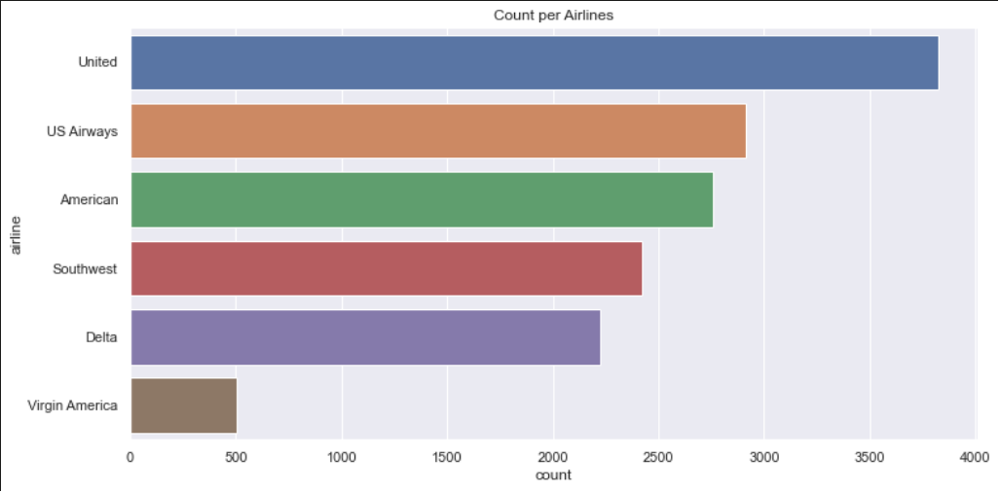
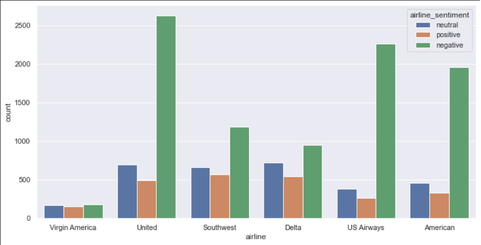
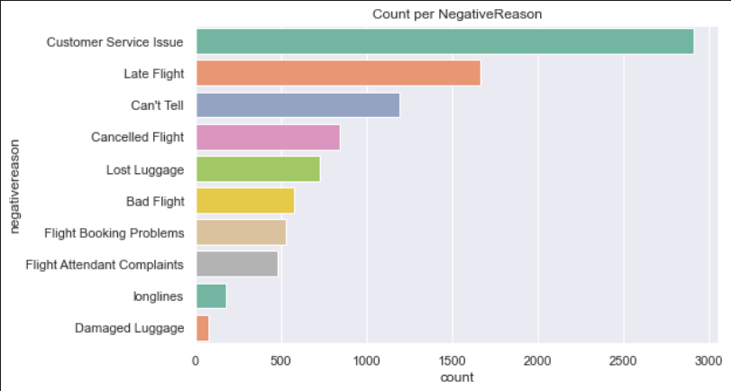
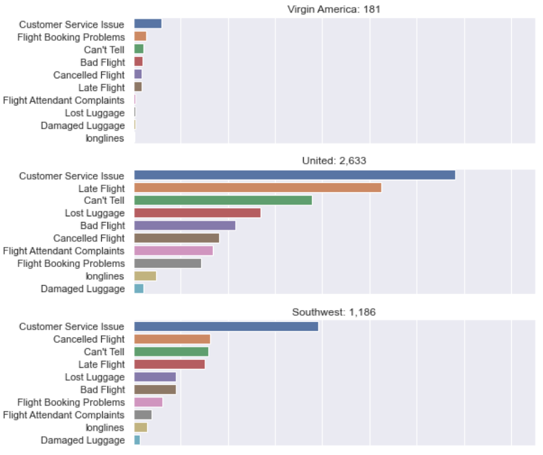
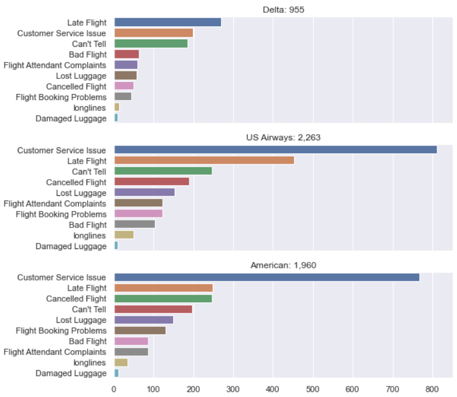

# U.S.-Airline-Sentiment-Project
Sentiment Analyses and Prediction Project

## Overview 

There are six different airline companies in this dataset and their customers still complaining about some problems with their services/flights. We are going to  analyze and making machine learning project for how airline companies could improve theirselves with our findings.

This is about why customers give airline negative,neutral or positive reasons. This will help airlines for further improvement.

## Business Problem

In this project, main goal is the analyze and predict airline sentiment(positive,neutral or negative) of flights depend on **customer review's text** with machine learning model. This will help airline companies for future work. Depend on customer's review airline companies could take action about it and improve theirselves.

## Dataset

The dataset provided on https://www.kaggle.com/crowdflower/twitter-airline-sentiment by ** Crowdflower's Data for Everyone library**.

Dataset has 14,640 entries and 15 columns.

    We have 6 different major U.S. airline companies; United, Us Airways, American , Soutwest,
    Delta and Virgin America.
    
    All the tweets scraped at 2015 February.
    
    We have three different target category as positive, neutral or negative depend on tweet.
    
    
## Exploratory Data Analysis(EDA)

Our target variable(airline_sentiment)'s frequency is ;

    negative     0.626913
    neutral      0.211680
    positive     0.161407
    
## Tweet Counts per Airline Companies

    This graph basically shows us tweet counts per airline companies depend on our data.
    

## Sentiments per Airline Companies

    Green bars shows us negative tweets and obviously negatives are really higher than others.
    
## Negative Reasons

    Customer Service Issue and Late Flight leads for general negative reasons from customer reviews.
    
    
## Negative Reasons per Airline Companies

    First of all Customer Service Issue leads for most of airline companies for negative reason as expected from previous graph. United airlines second problem `Late Flight` apperantly big problem for this airline for count compare to other airlines. And also lost luggage problem is higher at the United airlines than others.
    
    At Delta airlines instead of customer service late flight leads for negative reason.
    
    And for Virgin America booking problems look like a needs to be work on.
    

## Modeling 

The main metric that  I would be using to assess my models performance is `accuracy score`. Because each class equally important for us. We want to predict every class equally. Not focusing only positive or negatives. Every class important for this project.

### CountVectorizer
    1. Logistic Regression Score : 0.74
    2. Naive Bayes Score         : 0.77
    3. Ada Boost Score           : 0.75
    
### TF-IDF 
    1. Naive Bayes Score         : 0.70
    2. Logistic Regression Score : 0.77
    3. Random Forest Score       : 0.68
    4. Gradient Boosting Score   : 0.73
    
    
    This scores calculated on `test sets`. 

### Sequential 
    1. First Model Score      : 0.7845
    2. Second(Improved) Model : 0.9286
    
